

    <h1 style="text-align: center;">قابلیت ها و امکانات فروشگاه آنلاین و پنل مدیریت</h1>
    <h4>ویژگی ها</h4>
    <ol>
            <li>پیاده سازی ورود به سایت ، عضویت</li>
            <li>نمایش اسلایدشو</li>
            <li>نمایش دسته بندی محصولات</li>
            <li>نمایش محصولات با تفکیک دسته بندی هر محصول</li>
            <li>نمایش جدیدترین محصولات</li>
            <li>نمایش جدیدترین مقالات</li>
    </ol>
    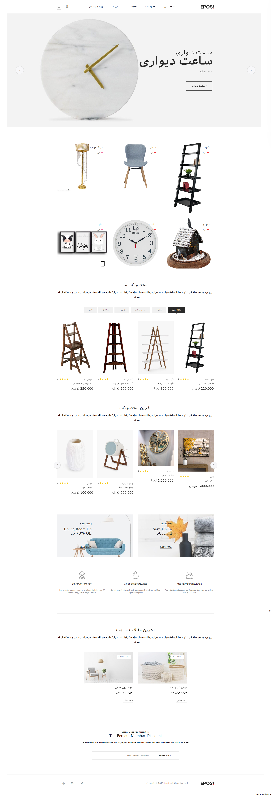
    <h4>ویژگی ها</h4>
    <ol>
        <li>نمایش جزئیات محصول</li>
        <li>برسی موجود بودن در انبار</li>
        <li>قابلیت اضافه کردن به سبد خرید</li>
        <li>امکان نمایش نظرات</li>
        <li>امکان ارسال نظر</li>
    </ol>
    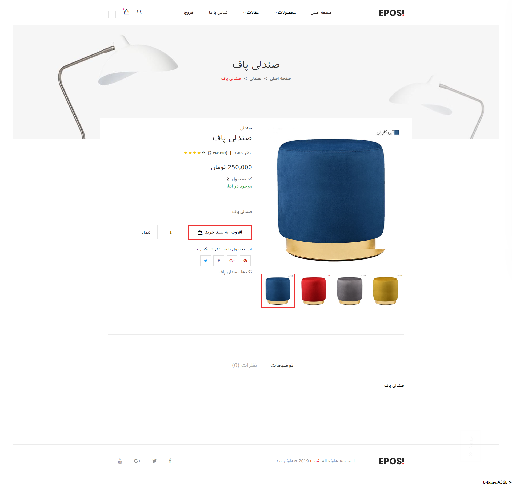
     
    <h3>نمایش تمام محصولات یک دسته بندی</h3>
    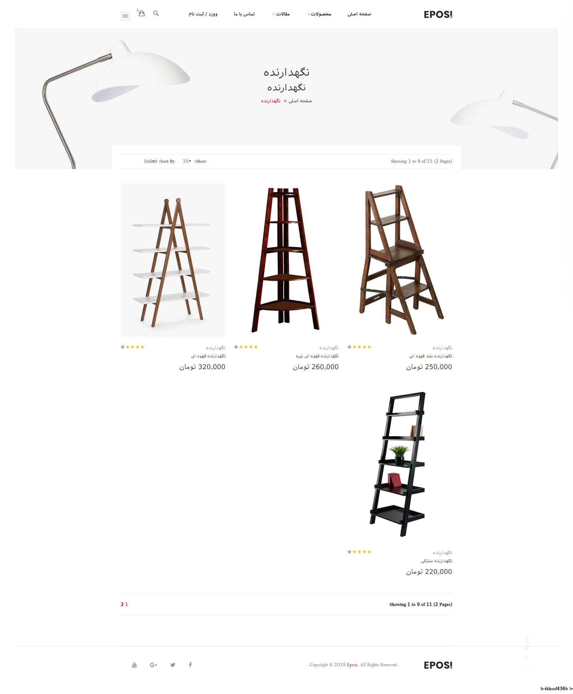
     
    <h3>نمایش محصولات موجود در سبد خرید</h3>
    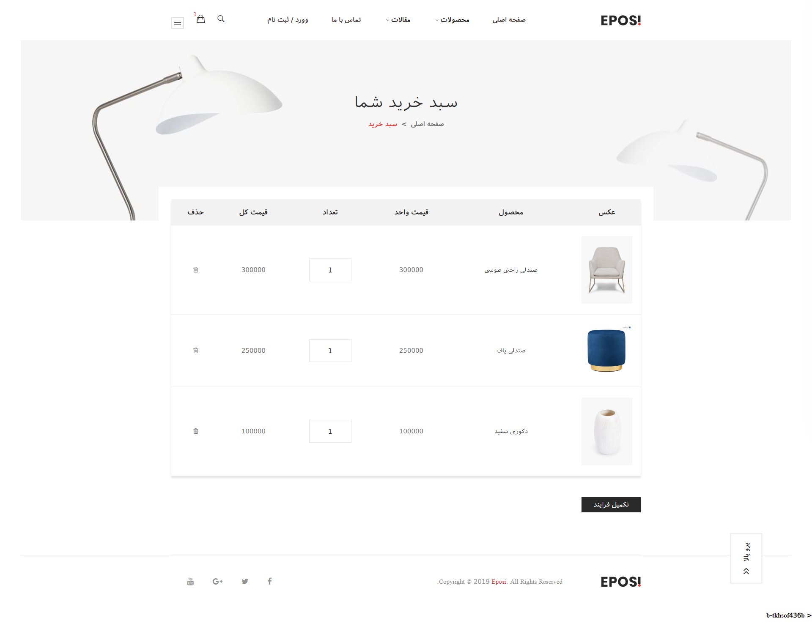
     
    <h3>نحوه پرداخت و تکمیل خرید</h3>
    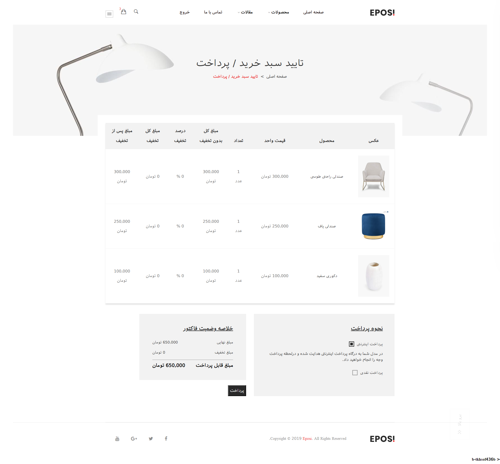
     
    <h4>امکانات پنل مدیریت</h4>
    <ul>
        <li>تعریف کاربر با نقش های مختلف و سطح دسترسی های مختلف</li>
        <li>مدیریت کاربران شامل ویرایش اطلاعات آنها ، ریست پسورد و حذف کاربران</li>
        <li>مدیریت نقش ها</li>
        <li>مدیریت دسته بندی محصولات</li>
        <li>مدیریت محصولات</li>
        <li>مدیریت عکس محصولات</li>
        <li>مدیریت اسلاید شو ها</li>
        <li>مدیریت سیستم تخفیفات</li>
        <li>مدیریت تخفیف مشتری و همکار</li> 
        <li>مدیریت نظرات محصولات</li>
        <li>مدیریت نظرات بلاگ</li>
        <li>قابلیت حذف، تائید و عدم تائید نظر های ارسالی</li>
        <li>مدیریت سیستم بلاگینگ</li>
        <li>مدیریت انبار</li>
        <li>قابلیت افزایش و کاهش محصولات در انبار</li>
        <li>مشاهده گردش انبار</li>
        <li>مدیریت سفارشات</li>
        <li>امکان تایید و لغو سفارش</li>
        <li>امکان مشاهده آیتم های سفارشات</li>
    </ul>
     
    <h3 style="text-align: center;">مدیریت انبار</h3>
    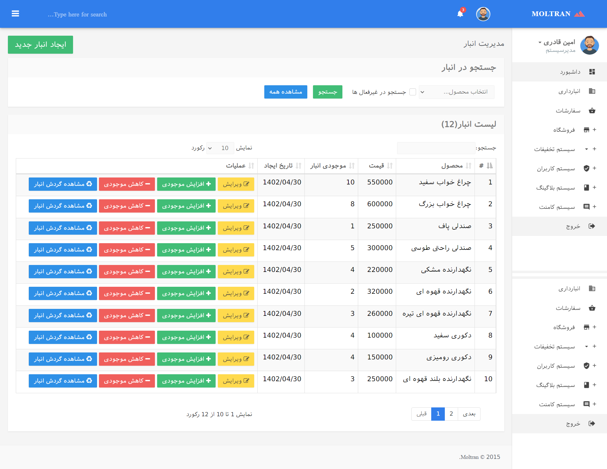
     
    <h3 style="text-align: center;">مدیریت سفارشات</h3>
    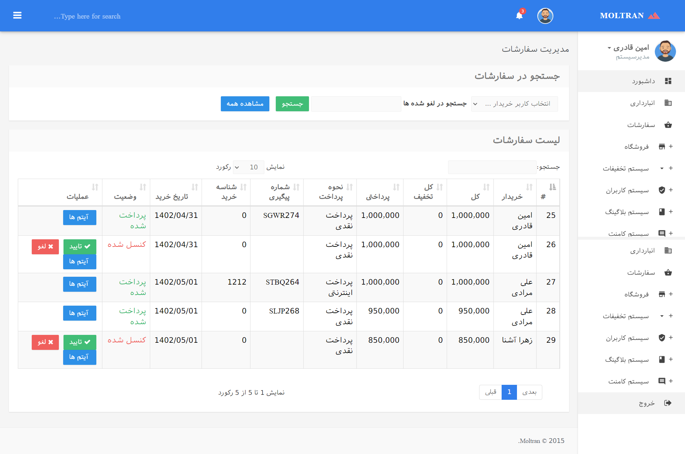
     
    <h3 style="text-align: center;">مدیریت اسلایدها</h3>
    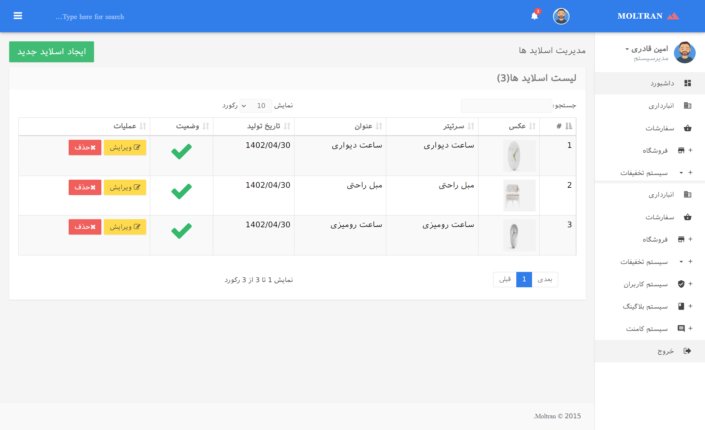
     
    <h3 style="text-align: center;">مدیریت گروه محصولات</h3>
    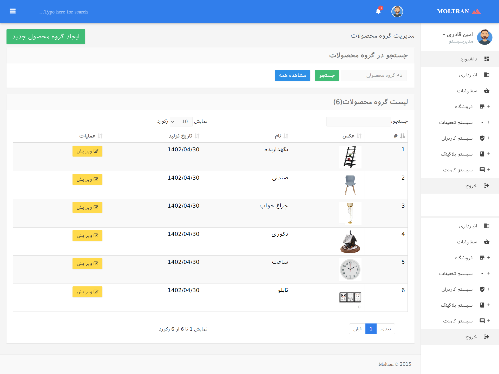
     
    <h3 style="text-align: center;">مدیریت محصولات</h3>
    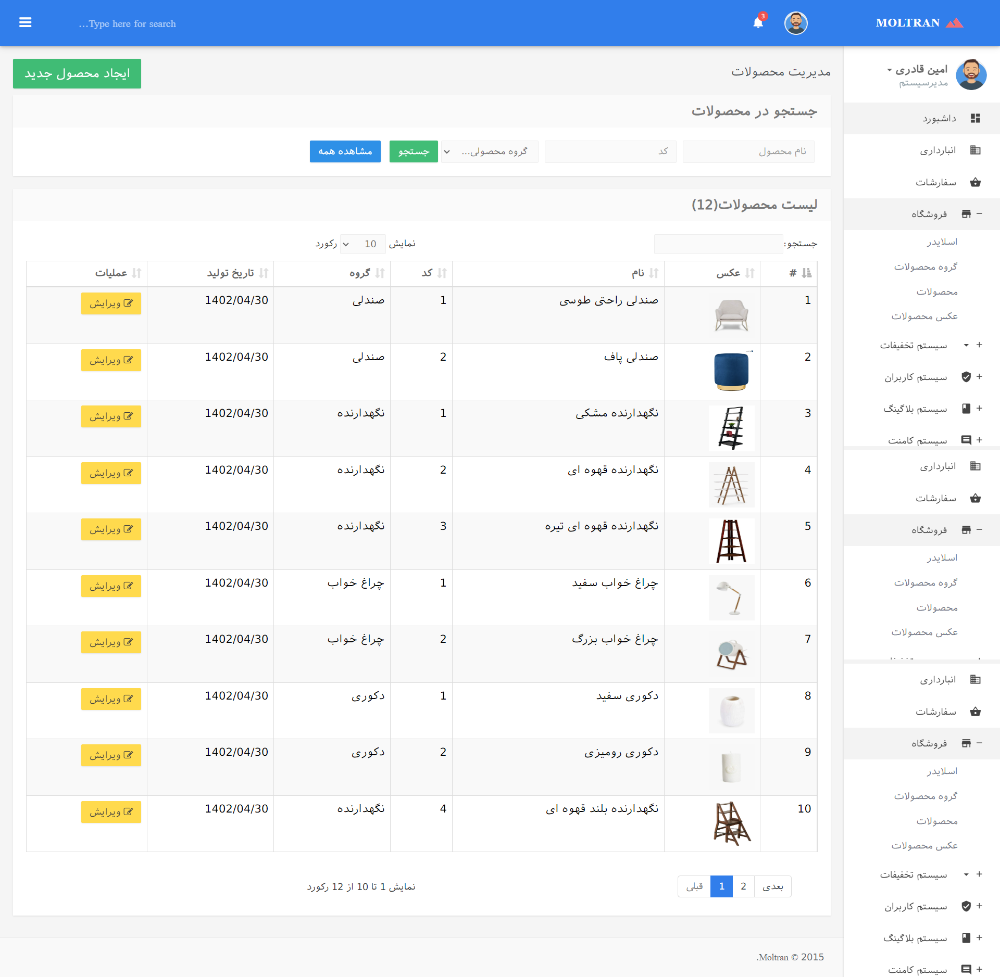
     
    <h3 style="text-align: center;">مدیریت عکس محصولات</h3>
    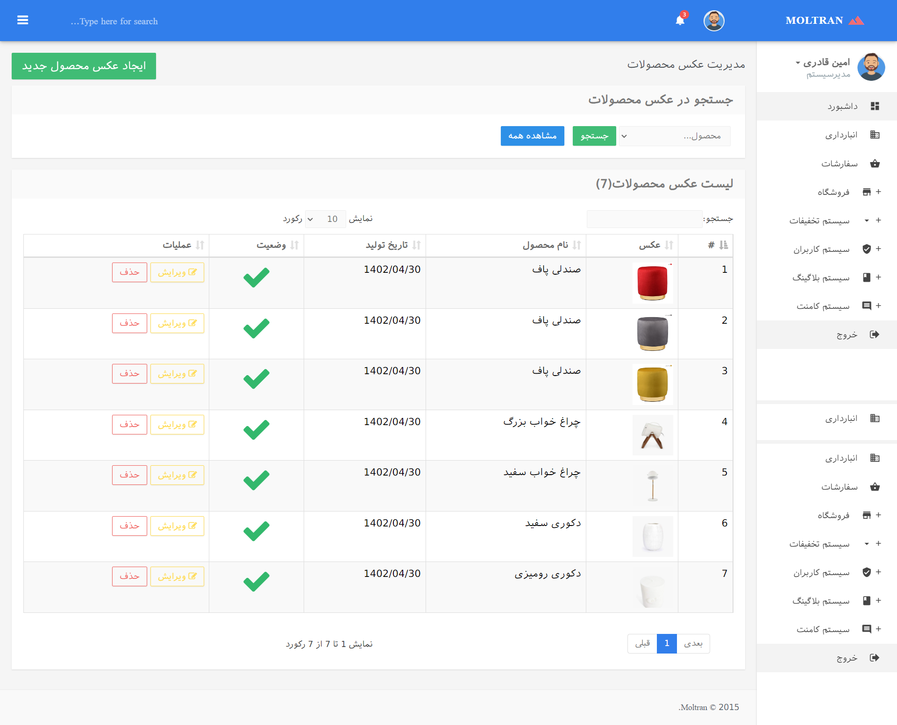
     
    <h3 style="text-align: center;">مدیریت کاربران</h3>
    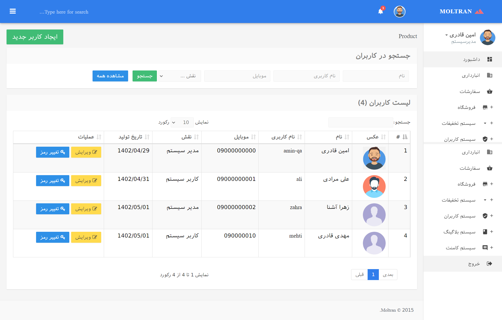
     
    <h3 style="text-align: center;">مدیریت نقش</h3>
    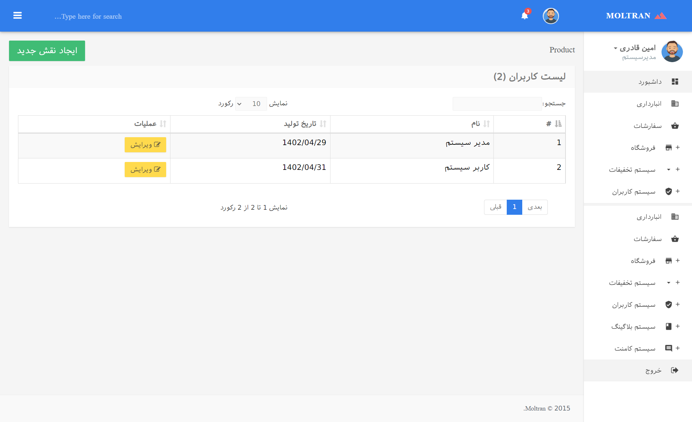

